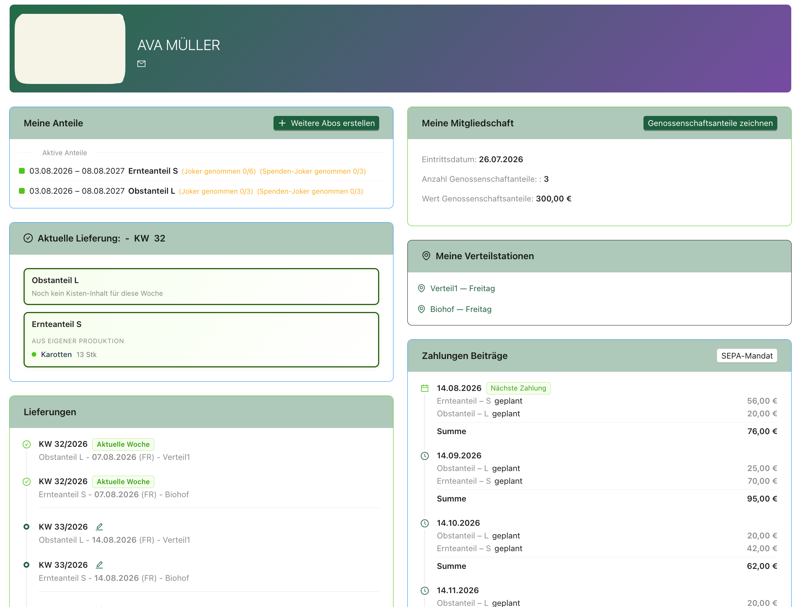
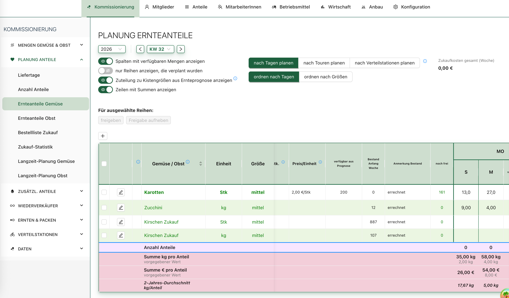
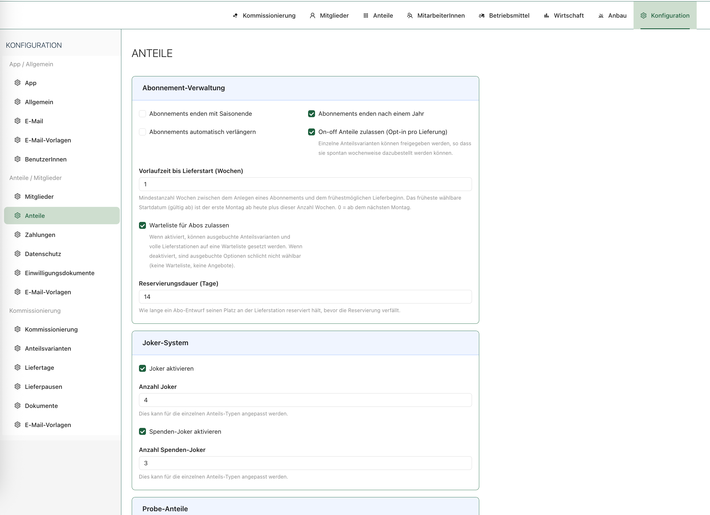

# Jasmin Platform

A multi-tenant management platform for CSA farms (Community Supported
Agriculture) — Django + React.

A CSA farm sells a season's harvest as **subscriptions** / shares of a harvest: members subscribe up front,
and each week their share of whatever was harvested is packed and delivered to a delivery station. Jasmin runs that whole operation — from the member's subscription and SEPA direct debit, through the weekly harvest and packing lists, to what actually gets planted in which bed next spring.

One deployment serves many independent farms. Each gets its own subdomain and its own isolated PostgreSQL schema.

## Screenshots

The interface is German — English, French and Italian locales exist, German is the source of truth.

**Member detail** — active shares with their joker counters, this week's crate contents, upcoming deliveries per station, cooperative shares, and the SEPA payment schedule.



**Weekly share-content planning** — one row per vegetable with stock and
forecast, then the per-day × per-share-size quantities that make up each week's crate, with running totals per share.



**Subscription configuration** — per-tenant rules for subscription terms and renewal, delivery lead time, waiting lists, and the joker system.



## What it does

- **Members & subscriptions** — member records, share subscriptions with trial /
  term / renewal chains, cooperative capital shares (Geschäftsanteile) with
  statutory retention and payback, waiting lists, pledge rounds.
- **Weekly delivery operations** — forecasts, harvesting and packing lists,
  cleaning lists, crate and label printing, delivery stations, delivery tours,
  per-member jokers (skip a week) and opt-ins.
- **Payments** — SEPA direct debit with mandate management, billing runs, charge
  schedules, debits, invoices and delivery notes.
- **Resellers & orders** — reseller accounts, order intake, delivery notes and
  invoices, offer groups, markets.
- **Warehouse & documentation** — stock levels, harvest / purchase / waste
  documentation, stock movements derived from a single recompute pipeline.
- **Cultivation planning** — vegetables, sorts, beds and plots, sowing and
  planting lists, seed and seedling ordering, plus a CP-SAT (OR-Tools) solver that places crops into beds under agronomic constraints.
- **Staff** — employees, weekly plan categories, absences, shift planning.
- **GDPR** — data export, deletion requests, consent management, PII access
  logging, retention policy enforcement.
- **Notifications** — templated transactional email dispatched through a
  background queue.
- **Platform administration** — a separate super-admin app for creating and
  managing tenants.

## Tech stack

**Backend** — Python 3.14, Django 5.2, Django REST Framework, PostgreSQL
(schema-per-tenant via django-tenants), Redis, Huey for background jobs,
drf-spectacular for OpenAPI, WeasyPrint for PDFs, OR-Tools for the cultivation solver.

**Frontend** — React 18, Vite, TypeScript, TanStack Query, React Router, Ant Design (+ some MUI), i18next, Orval-generated API client, @react-pdf/renderer.

**Infrastructure** — Docker Compose, Gunicorn, nginx, Let's Encrypt via certbot.

**Security** — JWT in httpOnly cookies, django-axes brute-force protection,
django-auditlog, encrypted model fields for PII.

## Quickstart

A self-contained, Docker-based setup. Everything — database, backend, frontend, mail — runs in containers; you do **not** need Python, Node or Postgres installed.

### 1. Prerequisites

- **Docker Desktop** (or Docker Engine) with **Compose v2** — check with
  `docker compose version`
- **git** and **make**
- ~3 GB free disk. The first build takes a few minutes; later starts are fast.

### 2. Get the code and the dev config

```bash
git clone https://github.com/birgit-seyr/jasmin.git
cd jasmin
cp .env.dev.example .env.dev
```

The dev defaults in `.env.dev` work out of the box — there are no secrets to
fill in for a local run.

### 3. Map the tenant hostnames

The platform resolves the tenant from the **subdomain**, so you reach a tenant at
`test.localhost`, not bare `localhost`. macOS and Linux don't auto-resolve
`*.localhost`, so add these to `/etc/hosts` once:

```bash
sudo sh -c 'printf "127.0.0.1 test.localhost\n127.0.0.1 marillen.localhost\n" >> /etc/hosts'
```

### 4. Start everything

```bash
make dev-up
```

This builds the images (first run only) and starts Postgres, Redis, the Django
backend, the Vite frontend, an nginx gateway and MailHog. On startup it
**automatically runs migrations and seeds a ready-to-use test tenant** with
logins — there's nothing else to set up.

Wait until the backend logs show `Starting Django dev server ...`. Tail logs any
time with `make dev-logs`.

### 5. Log in

Open **http://test.localhost:3000** and sign in:

| Role         | Email                           | Password         |
| ------------ | ------------------------------- | ---------------- |
| **Admin**    | `admin@test.localhost`          | `Test-Test-2026` |
| Member       | `test-member@example.com`       | `Test-Test-2026` |
| Customer     | `test-customer@example.com`     | `Test-Test-2026` |
| Staff        | `test-staff@example.com`        | `Test-Test-2026` |
| Office       | `test-office@example.com`       | `Test-Test-2026` |
| Staff+Member | `test-staff-member@example.com` | `Test-Test-2026` |

Start with **Admin** for the full picture.

To populate a tenant with real configuration, follow
[docs/tenant-setup-guide.md](docs/tenant-setup-guide.md).

### Other URLs

| What                              | URL                              |
| --------------------------------- | -------------------------------- |
| Tenant app                        | <http://test.localhost:3000>     |
| Outgoing email (MailHog)          | <http://localhost:8025>          |
| Backend API + docs                | <http://localhost:8000/api/docs> |
| Super-admin / platform (optional) | <http://marillen.localhost:3000> |

- **MailHog** catches every email the app sends (invitations, password resets, …)
  — nothing leaves your machine. Check it to grab links the UI would email.
- **Super-admin** is optional (tenant management). It needs its own account:
  `make dev-bash`, then `python manage.py createsuperadmin`.

### Handy commands

| Command          | Does                                                      |
| ---------------- | --------------------------------------------------------- |
| `make dev-logs`  | Tail all container logs                                   |
| `make dev-down`  | Stop the stack (keeps the database)                       |
| `make dev-reset` | Wipe the database and restart fresh (re-seeds the tenant) |
| `make dev-seed`  | Re-seed the test tenant manually                          |
| `make dev-bash`  | Open a shell in the backend container                     |

## How multi-tenancy works

Worth understanding early — it's the thing that surprises people on first
contact.

- Each tenant organisation gets its own **PostgreSQL schema**. Business data
  (members, subscriptions, payments, …) lives there and is invisible to every
  other tenant.
- The **public schema** holds only cross-tenant data: tenant definitions,
  domains, super-admin users.
- The tenant is resolved **from the request's subdomain** by django-tenants'
  `TenantMainMiddleware` — `farm-a.example.com` → the `farm_a` schema. The
  frontend sends no tenant header; it detects the platform vs. tenant domain at
  runtime and mounts either the super-admin app or the tenant app.
- Consequently migrations run twice: `migrate_schemas --shared` once, and
  `migrate_schemas --tenant` across every tenant schema.

## Repository layout

```
jasmin-core/
  django-core/            Django backend
    apps/
      accounts/           Users, profiles, roles
      authz/              Permissions, tenant-bound JWT auth
      commissioning/      Members, shares, deliveries, resellers, warehouse
      cultivation/        Growing plans, sowing/planting, CP-SAT bed planner
      economics/          Budgets, business plan, key figures
      gdpr/               Export, deletion, consents
      notifications/      Email templates and dispatch
      payments/           SEPA direct debit, billing runs, subscriptions
      staff/              Scheduling, absences
      shared/             tenants/, super_admin/, cross-app utilities
    config/               Settings, URL configs
  react-core/             React frontend
    src/
      app/                Bootstrap, shell, routing
      shared/             Design system, tables, hooks, contexts, API client
      features/           One folder per domain (commissioning, members, …)
      test/               Vitest setup, MSW handlers
docs/                     Domain, operations, GDPR and security documentation
nginx/                    Gateway configuration
scripts/                  Deployment and maintenance scripts
```

## Development

### Running tests

```bash
# Backend (pytest inside the backend container — needs `make dev-up` first)
make pytest
make pytest ARGS="apps/payments/tests -k billing"   # narrow it down

# Frontend (Vitest)
cd jasmin-core/react-core && npm run test:run
```

### Linting and type checks

```bash
make black          # Python formatting check
make ruff           # Python lint
make type-check     # TypeScript
make lint           # ESLint
```

`make check` runs the whole gate — formatting, lint, backend tests, type-check
and frontend tests — the same set CI enforces on every push and pull request.

### After changing the API

The frontend's API client is generated from the backend's OpenAPI schema. When
you change a serializer or viewset:

```bash
make generate-api   # regenerates schema.yml, then the typed React client
```

Commit the regenerated `schema.yml` and client — CI checks they're current.
Never hand-edit them.

### Conventions

Architectural rules, naming conventions and the pitfalls worth knowing before
your first change are documented in [CLAUDE.md](CLAUDE.md). It's written as
guidance for AI coding assistants, but it's the most complete statement of this
codebase's conventions and is just as useful to a human contributor.

The [domain glossary](docs/domain-glossary.md) explains the `Share*` family and
why `Share` and `CoopShare` must never be conflated — worth reading before your
first change to `apps/commissioning/`. The GDPR documentation set (data
inventory, DPIA, processing activities, retention policy, breach runbook) lives
in [docs/gdpr/](docs/gdpr/README.md).

## License

Copyright (C) 2026 Birgit Seyr

This program is free software: you can redistribute it and/or modify it under
the terms of the **GNU Affero General Public License** as published by the Free
Software Foundation, either version 3 of the License, or (at your option) any
later version.

This program is distributed in the hope that it will be useful, but WITHOUT ANY
WARRANTY; without even the implied warranty of MERCHANTABILITY or FITNESS FOR A
PARTICULAR PURPOSE. See the GNU Affero General Public License for more details.

The full license text is in [LICENSE](LICENSE).

Because this is an AGPL-licensed network application: **if you run a modified
version of this software as a service, you must make the complete corresponding
source code of your modified version available to its users.**
